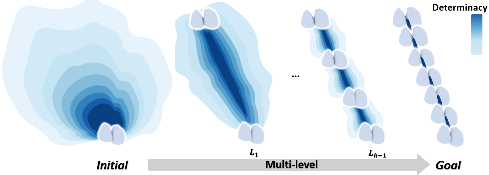

<p align="center">

  <h1 align="center">Progressive Target-free Orthodontic Planning based
on Hierarchical Diffusion Transformer</h1>
<!--   <h2 align="center">TPAMI 2025</h2> -->
<!--   <h3 align="center"><a href="https://arxiv.org/pdf/2410.18477">Paper</a> | <a href="https://chuanxiang-yang.github.io/S2DF/">Project Page</a> | <a href="https://arxiv.org/abs/2410.18477">arXiv</a> </h3> -->
  <div align="center"></div>
</p>
<p align="center">
  
</p>


  In this paper, we tackle the problem of target-free tooth motion generation in digital orthodontics, with the goal of assisting orthodontic planning without relying on target tooth alignment from experienced dental experts. In practice, only the initial alignment of the patient is obtained. However, no existing method can predict the complete motion sequence using only the initial tooth alignment. To address this gap, we propose OrthoDiff, a novel target-free framework that uses only the initial tooth alignment through a progressive generation strategy. This strategy generates tooth motion sequences by decomposing the entire motion sequence into multi-level motions, progressively constraining the inference space and reducing the complexity of target-free planning from coarse to fine. Moreover, we design a hierarchical diffusion transformer as the backbone of OrthoDiff, which treats tooth alignment as a sequence of tooth tokens and fully leverages the topological prior knowledge of the dental
model. Through extensive evaluations, we demonstrate that our method significantly outperforms state-of-the-art techniques in target-free tooth motion generation. Ablation studies further confirm the efficacy of the key components in our network
design.
  
## Install
   

## Dataset
Please organize the data according to the following structure. We provide the input tooth motion process.
```
│data/
├──model_name/
├──path_lower/
├──path_upper/
├──rtv_gt/

...
```

## Demo

https://github.com/user-attachments/assets/643a3923-6794-4141-814b-caeddc832eb6

https://github.com/user-attachments/assets/69b0033c-33dc-4c9f-9daf-9e1bf80cf207

https://github.com/user-attachments/assets/1fbb4f15-7ac3-41ea-8a39-169ed9bed214

https://github.com/user-attachments/assets/eb81ccc8-11d6-4438-9c67-18b77e700110

https://github.com/user-attachments/assets/4e6b2019-a30e-4a98-85e4-5f0fb854ba65


